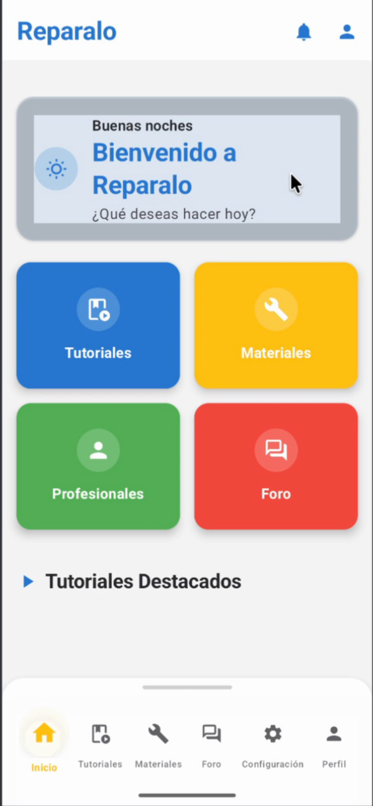
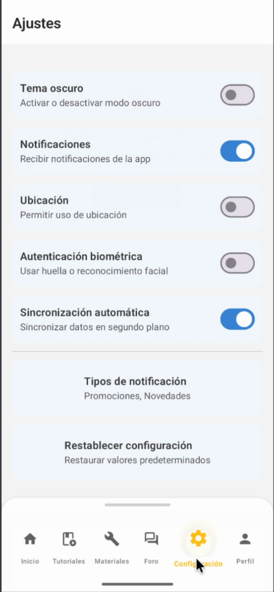
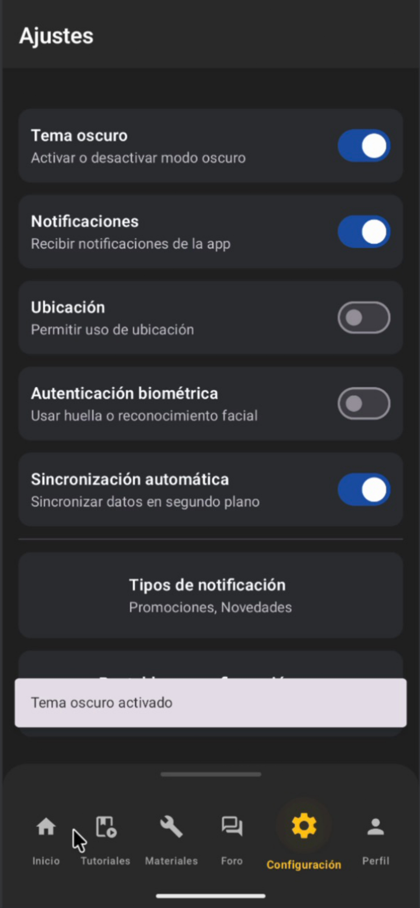
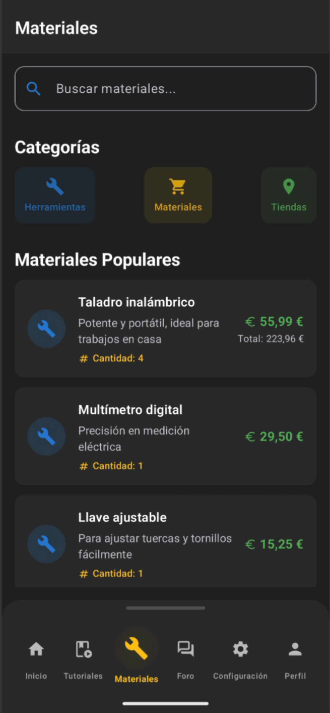
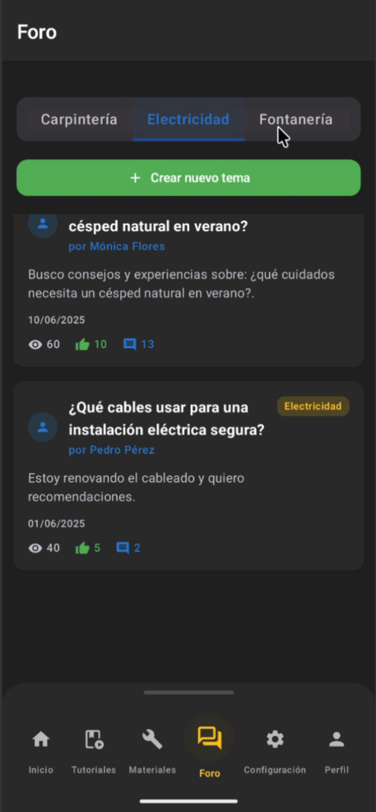
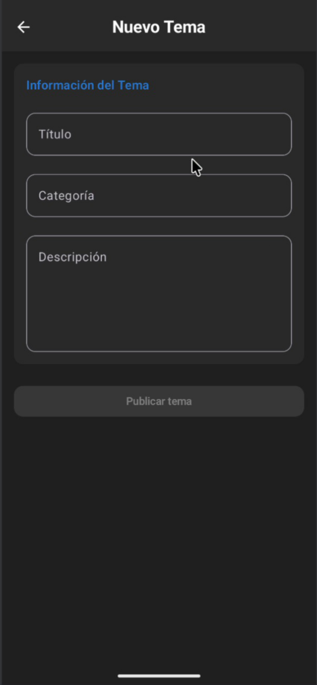
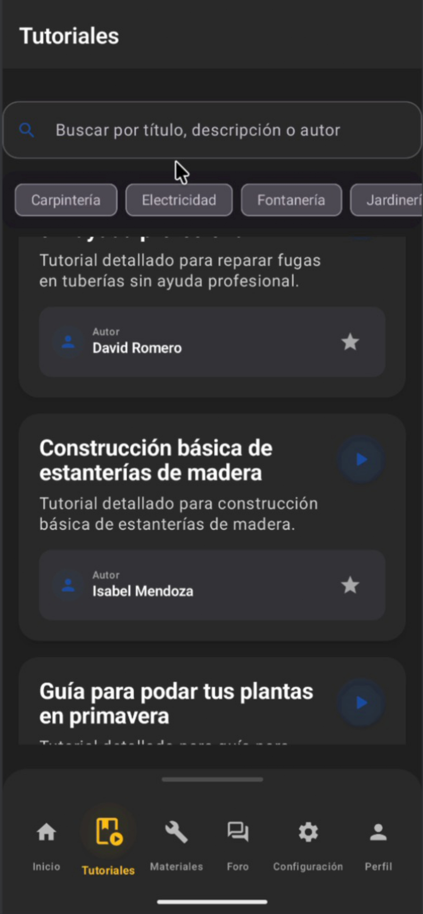
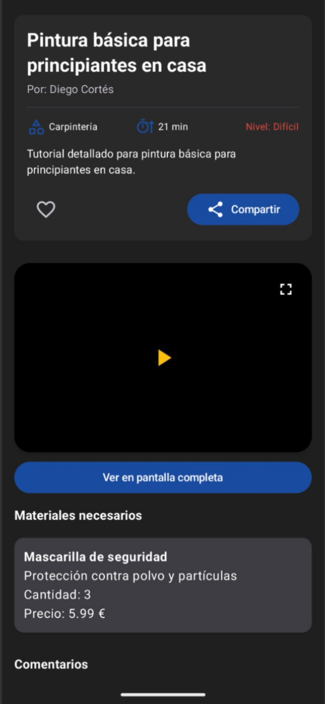
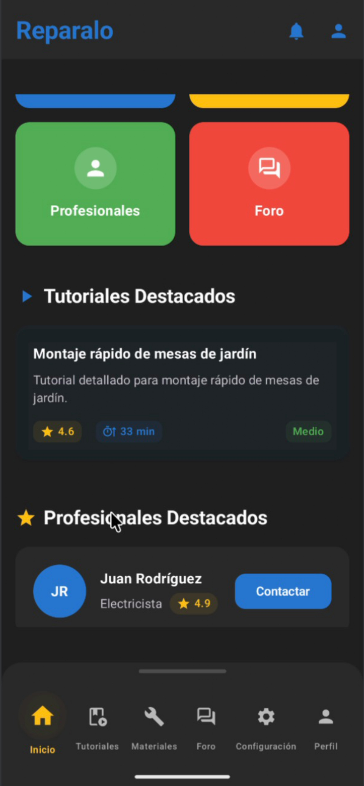
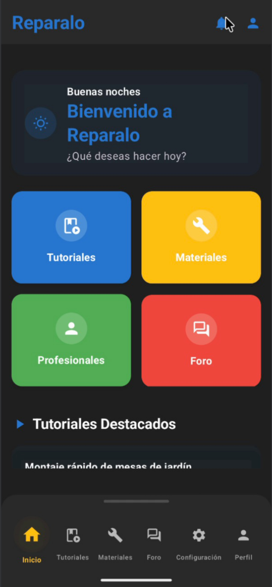

# Reparalo. Fix it at Home

## Descripción

**Reparalo** es una aplicación móvil que ayuda a los usuarios a resolver problemas del hogar mediante:

- Tutoriales detallados paso a paso.  
- Listas de materiales necesarios.  
- Estimación de presupuestos.  
- Conexión con técnicos calificados.

El objetivo es facilitar las reparaciones en casa, ya sea para quienes prefieren el **DIY** o contratar a un profesional.

---

## Tecnologías

- **Frontend:** Kotlin (Jetpack Compose para Android)  
- **Backend:** Firebase (Firestore y Firebase Authentication)  
- **APIs integradas:**
  - YouTube API (tutoriales en vídeo)
  - Google Maps API (tiendas y técnicos cercanos)
  - Twilio API (notificaciones SMS/WhatsApp)

---

## Enlaces del proyecto

- 🎨 **Diseño en Figma:** [🔗 Link a Figma](https://www.figma.com/)  
- 💻 **Repositorio:** [🔗 GitHub – jsborbon/Reparalo](https://github.com/jsborbon/Reparalo)

---

## Estado

- [x] UI inicial en Figma  
- [x] Implementación base en Kotlin con Jetpack Compose  
- [x] Integración de Firebase Auth  
- [x] Gestión de datos con Firestore  
- [ ] Integración de APIs externas (YouTube, Google Maps, Twilio)

---

## Instalación

1) Clonar el repo:
```bash
git clone https://github.com/jsborbon/Reparalo.git
```

2) Abrir el proyecto en **Android Studio**.

3) Configurar Firebase:
   - Crear proyecto en [Firebase Console](https://console.firebase.google.com/)
   - Descargar `google-services.json` y colocarlo en `app/`.

4) Ejecutar en emulador o dispositivo físico.

---

## 🖼️ Capturas (`./screenshots/`)

### 1) Pantalla de Inicio (modo claro)
Bienvenida contextual (saludo por momento del día), accesos rápidos a **Tutoriales**, **Materiales**, **Profesionales** y **Foro**, y acceso a notificaciones/perfil.  
<p align="center"></p>

---

### 2) Ajustes (modo claro)
Preferencias principales: **tema oscuro**, **notificaciones**, **ubicación**, **biometría**, **sincronización**, y restaurar configuración.  
<p align="center"></p>

---

### 3) Ajustes (modo oscuro)
Mismas opciones con la paleta **Dark**; se muestra confirmación “Tema oscuro activado”.  
<p align="center"></p>

---

### 4) Materiales
Buscador + categorías. Listado de materiales con **precio**, **subtotal** y **cantidad** (útil para armar presupuesto rápido).  
<p align="center"></p>

---

### 5) Foro (categorías)
Tabs de categorías (Carpintería, Electricidad, Fontanería…), botón **“Crear nuevo tema”**, y tarjetas con métricas (vistas, likes, comentarios).  
<p align="center"></p>

---

### 6) Crear nuevo tema
Formulario minimal para **título**, **categoría** y **descripción**, con CTA **“Publicar tema”**.  
<p align="center"></p>

---

### 7) Tutoriales (explorar)
Buscador por **título/autor/descripcion**, chips de categorías y cards con autor, favoritos, etc.  
<p align="center"></p>

---

### 8) Detalle de tutorial
Título, autor, categoría, duración y nivel. Video embebido, botón **pantalla completa**, **materiales necesarios** y sección de comentarios.  
<p align="center"></p>

---

### 9) Inicio (bloques destacados)
Bloques grandes de acceso rápido, sección **“Tutoriales Destacados”** con badges (rating, duración, dificultad).  
<p align="center"></p>

---

### 10) Inicio (modo oscuro)
Variante **Dark** del Home con los mismos accesos y secciones en la paleta oscura.  
<p align="center"></p>


## Créditos

📌 **Desarrollado por:** Javier Santiago Borbón Borbón
